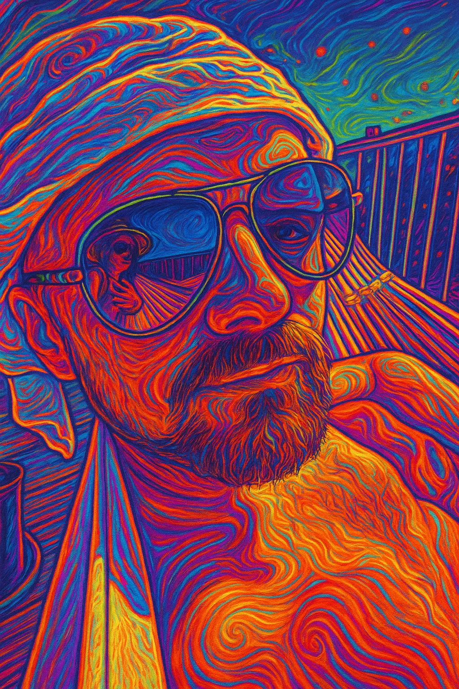

<table>
<tr>
<td valign="top" width="50%">



<br><br>

### 📈 Activity Patterns


</td>
<td valign="top" width="50%">

<div align="center">

```
██╗   ██╗██╗██████╗ ██╗███╗   ██╗ ██████╗ 
██║   ██║██║██╔══██╗██║████╗  ██║██╔════╝ 
██║   ██║██║██████╔╝██║██╔██╗ ██║██║  ███╗
╚██╗ ██╔╝██║██╔══██╗██║██║╚██╗██║██║   ██║
 ╚████╔╝ ██║██████╔╝██║██║ ╚████║╚██████╔╝
  ╚═══╝  ╚═╝╚═════╝ ╚═╝╚═╝  ╚═══╝ ╚═════╝ 
```

</div>

### 🎩 *Digital architect from the retro-futuristic timeline*

Building systems with the precision of a spacecraft engineer and the imagination of a golden-age sci-fi author. Currently navigating between embedded systems, cloud architectures, and desktop applications.

#### 🚀 Current Explorations
- 🤖 Embracing the AI-assisted coding revolution with Claude, Copilot, and emerging LLMs
- 🏗️ Orchestrating cloud deployments as an Infrastructure as Code fanatic
- ☁️ Architecting distributed systems across cloud infrastructure and edge computing realms
- 🌐 Crafting web experiences that transcend the mundane
- 🔧 Programming embedded systems for the cybernetic age

### 🛠️ Technological Arsenal

#### Programming Languages


#### Cloud & Infrastructure


#### Web Technologies


#### Embedded Systems & IoT


#### Tools & Environment


#### AI-Assisted Development


### 🎯 Operating Parameters
- 🤖 Extensive practitioner of AI-pair programming across multiple LLM platforms
- 🛸 Coding in the spirit of retro-futuristic system architects
- 🦅 Devoted ornithologist who finds debugging akin to birdwatching
- 📡 Embedded systems whisperer with a penchant for ESP32 & ARM
- 🧪 Perpetual constructor of cybernetic contraptions

</td>
</tr>
</table>

<div align="center">

---
<sub>Composed with vim and an abundance of refinement 🎩</sub>

</div>